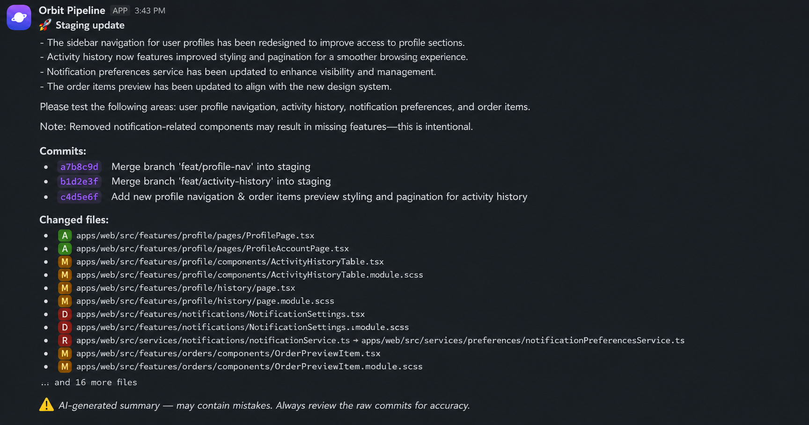

# StagingBrief

> Automatic staging deployment summaries for your designers and product managers.
> Runs in your GitLab CI pipeline. Posts a human-readable Slack message on every deploy.
> Your source code never leaves your infrastructure.



---

## The problem

When code is deployed to staging, designers and non-technical team members have no
visibility into what changed. They don't read commits. They don't watch pipelines.
The result: they don't know what to test, what changed visually, or whether their
feedback from last week was addressed.

StagingBrief fixes that with one CI stage and one Slack message.

---

## How it works

1. A deployment to your staging environment triggers the StagingBrief stage in GitLab CI
2. StagingBrief fetches the commits and changed files since the last successful deploy
3. An LLM summarises the changes in plain language — no jargon, no commit hashes
4. Your team receives a Slack message with the summary, raw commits, and changed files

---

## Quick start

### 1. Add the CI stage to your `.gitlab-ci.yml`

```yaml
notify-staging:
  stage: notify
  image: bytesfue/stagingbrief:latest
  script:
    - /notify
  rules:
    - if: '$CI_COMMIT_BRANCH == "develop" && $CI_PIPELINE_SOURCE == "push"'
  variables:
    GITLAB_PROJECT_ID: $CI_PROJECT_ID
    GITLAB_TOKEN: $STAGINGBRIEF_GITLAB_TOKEN
    OPENAI_API_KEY: $STAGINGBRIEF_OPENAI_KEY
    SLACK_BOT_TOKEN: $STAGINGBRIEF_SLACK_BOT_TOKEN
    SLACK_CHANNEL_ID: $STAGINGBRIEF_SLACK_CHANNEL_ID
    GITLAB_PROJECT_NAME: "Your Project Name"
```

`CI_API_V4_URL` is a predefined GitLab CI variable and is injected
automatically — no configuration needed..

### 2. Add the CI/CD variables to your GitLab project

Settings → CI/CD → Variables:

| Variable | Description |
|---|---|
| `STAGINGBRIEF_GITLAB_TOKEN` | GitLab personal access token with `read_api` scope |
| `STAGINGBRIEF_OPENAI_KEY` | OpenAI API key |
| `STAGINGBRIEF_SLACK_BOT_TOKEN` | Slack bot token (`xoxb-...`) |
| `STAGINGBRIEF_SLACK_CHANNEL_ID` | Slack channel ID to post to |

### 3. Deploy to staging

That's it. The next push to your staging branch will trigger a Slack message.

---

## Configuration

All configuration is via environment variables passed through GitLab CI.

### Required

| Variable | Description |
|---|---|
| `GITLAB_TOKEN` | GitLab personal access token with `read_api` scope |
| `GITLAB_PROJECT_ID` | GitLab project ID (use `$CI_PROJECT_ID`) |
| `OPENAI_API_KEY` | OpenAI API key |
| `SLACK_BOT_TOKEN` | Slack bot token (`xoxb-...`) |
| `SLACK_CHANNEL_ID` | Slack channel ID |

### Optional

| Variable | Default | Description |
|---|---|---|
| `GITLAB_PROJECT_NAME` | project ID | Display name shown in the Slack message header |
| `OPENAI_MODEL` | `gpt-4o-mini` | OpenAI model to use |
| `SHOW_CHANGED_FILES` | `true` | Show changed files section in Slack message |
| `SHOW_RAW_COMMITS` | `true` | Show raw commits section in Slack message |
| `MAX_FILES` | `10` | Maximum changed files to show (0 = no limit) |
| `MAX_COMMITS` | `10` | Maximum commits to show (0 = no limit) |

---

## Privacy

StagingBrief sends only **commit messages and changed file paths** to the LLM API.
Your source code, file contents, and diffs never leave your infrastructure.

If even commit messages are sensitive, you can self-host the entire tool —
it's a single binary in a Docker container with no external dependencies beyond
the APIs you configure.

---

## Slack app setup

StagingBrief uses a Slack bot token rather than an incoming webhook,
giving you more control over which channel receives messages.

1. Go to [api.slack.com/apps](https://api.slack.com/apps) → **Create New App** → From scratch
2. **OAuth & Permissions** → Bot Token Scopes → add `chat:write`
3. **Install to Workspace** → copy the `xoxb-...` bot token
4. Invite the bot to your channel: `/invite @yourbotname`
5. Copy the channel ID (right-click channel → View channel details → bottom of modal)

---

## Requirements

- GitLab CI/CD pipeline
- OpenAI API key ([platform.openai.com](https://platform.openai.com))
- Slack workspace with a bot token

---

## License

MIT — see [LICENSE](LICENSE)