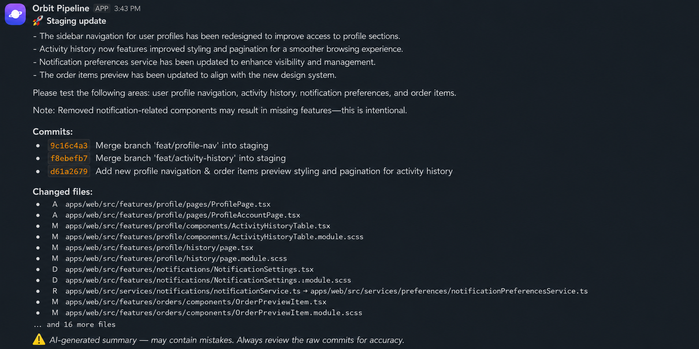

# StagingBrief

> Automatic staging deployment summaries for your designers and product managers.
> Runs in your GitLab CI pipeline. Posts a human-readable Slack message on every deploy.
> Your source code never leaves your infrastructure.



---

## The problem

When code is deployed to staging, designers and non-technical team members have no
visibility into what changed. They don't read commits. They don't watch pipelines.
The result: they don't know what to test, what changed visually, or whether their
feedback from last week was addressed.

StagingBrief fixes that with one CI stage and one Slack message.

---

## How it works

1. A deployment to your staging environment triggers the StagingBrief stage in GitLab CI
2. StagingBrief fetches the commits and changed files since the last successful deploy
3. An LLM (OpenAI or Claude — your choice) summarises the changes in plain language — no jargon, no commit hashes
4. Your team receives a Slack message with the summary, raw commits, and changed files

If there are no commits since the last deploy (e.g. a pipeline re-run with no new code),
StagingBrief posts a brief "no changes" message rather than staying silent, so you always
get a signal that the deploy happened. Set `NOTIFY_ON_NO_CHANGES=false` to suppress this
and skip notifying entirely in that case. The same applies to a project's very first
deploy, when there's no previous pipeline to compare against.

---

## Quick start

### 1. Add the CI stage to your `.gitlab-ci.yml`

```yaml
notify-staging:
  stage: notify
  image: bytesfue/stagingbrief:v1.0.0  # Pin to a specific version for reproducibility
  script:
    - /notify
  rules:
    - if: '$CI_COMMIT_BRANCH == "develop" && $CI_PIPELINE_SOURCE == "push"'
  variables:
    GITLAB_PROJECT_ID: $CI_PROJECT_ID
    GITLAB_TOKEN: $STAGINGBRIEF_GITLAB_TOKEN
    OPENAI_API_KEY: $STAGINGBRIEF_OPENAI_KEY
    SLACK_BOT_TOKEN: $STAGINGBRIEF_SLACK_BOT_TOKEN
    SLACK_CHANNEL_ID: $STAGINGBRIEF_SLACK_CHANNEL_ID
    GITLAB_PROJECT_NAME: "Your Project Name"
```

`CI_API_V4_URL`, `CI_COMMIT_SHA`, and `CI_COMMIT_BRANCH` are predefined GitLab CI variables
and are injected automatically — no configuration needed.

### 2. Add the CI/CD variables to your GitLab project

Settings → CI/CD → Variables:

| Variable | Description |
|---|---|
| `STAGINGBRIEF_GITLAB_TOKEN` | GitLab personal access token with `read_api` scope |
| `STAGINGBRIEF_OPENAI_KEY` | OpenAI API key |
| `STAGINGBRIEF_SLACK_BOT_TOKEN` | Slack bot token (`xoxb-...`) |
| `STAGINGBRIEF_SLACK_CHANNEL_ID` | Slack channel ID to post to |

### 3. Deploy to staging

That's it. The next push to your staging branch will trigger a Slack message.

### Using Claude instead of OpenAI

StagingBrief can generate the summary with Claude instead of OpenAI — useful if you'd
rather not hold an OpenAI key, or want to compare summary quality/cost. Exactly one
provider is active per pipeline run; set `LLM_PROVIDER: claude` and swap the API key
variable in your `.gitlab-ci.yml`:

```yaml
  variables:
    GITLAB_PROJECT_ID: $CI_PROJECT_ID
    GITLAB_TOKEN: $STAGINGBRIEF_GITLAB_TOKEN
    LLM_PROVIDER: claude
    ANTHROPIC_API_KEY: $STAGINGBRIEF_ANTHROPIC_KEY
    SLACK_BOT_TOKEN: $STAGINGBRIEF_SLACK_BOT_TOKEN
    SLACK_CHANNEL_ID: $STAGINGBRIEF_SLACK_CHANNEL_ID
    GITLAB_PROJECT_NAME: "Your Project Name"
```

`OPENAI_API_KEY` is not required in this mode. See Configuration below for the full
list of provider-specific variables.

---

## Configuration

All configuration is via environment variables passed through GitLab CI.

### Required

| Variable | Description |
|---|---|
| `GITLAB_TOKEN` | GitLab personal access token with `read_api` scope |
| `GITLAB_PROJECT_ID` | GitLab project ID (use `$CI_PROJECT_ID`) |
| `OPENAI_API_KEY` | OpenAI API key — required when `LLM_PROVIDER` is `openai` (the default) |
| `ANTHROPIC_API_KEY` | Anthropic API key — required when `LLM_PROVIDER` is `claude` |
| `SLACK_BOT_TOKEN` | Slack bot token (`xoxb-...`) |
| `SLACK_CHANNEL_ID` | Slack channel ID |

Only the API key matching your `LLM_PROVIDER` choice is required — exactly one LLM
provider is ever active per run, never both.

### Optional

| Variable | Default | Description |
|---|---|---|
| `GITLAB_PROJECT_NAME` | project ID | Display name shown in the Slack message header |
| `LLM_PROVIDER` | `openai` | LLM provider to use for the summary — `openai` or `claude` |
| `OPENAI_MODEL` | `gpt-5-mini` | OpenAI model to use (when `LLM_PROVIDER` is `openai`) |
| `ANTHROPIC_MODEL` | `claude-haiku-4-5` | Claude model to use (when `LLM_PROVIDER` is `claude`) |
| `SHOW_CHANGED_FILES` | `true` | Show changed files section in Slack message |
| `SHOW_RAW_COMMITS` | `true` | Show raw commits section in Slack message |
| `MAX_FILES` | `10` | Maximum changed files to show (0 = no limit) |
| `MAX_COMMITS` | `10` | Maximum commits to show (0 = no limit) |
| `NOTIFY_ON_NO_CHANGES` | `true` | Post a brief Slack message even when there are no commits since the last deploy (e.g. a re-run with no code changes). Set to `false` to stay silent instead. |

Even with `MAX_FILES`/`MAX_COMMITS` limits, an unusually large deploy could still
produce a message that exceeds Slack's ~40,000-character size limit. If that
happens, StagingBrief hard-truncates the message and appends a notice — you'll
still get a Slack notification, just with a note that some detail was cut off
in favor of checking GitLab directly.

---

## Privacy

StagingBrief sends only **commit messages and changed file paths** to the LLM API.
Your source code, file contents, and diffs never leave your infrastructure.

**Note on LLM summaries:** Because commit messages are sent to the LLM, a crafted or
malicious commit message could influence the generated summary. The summary is advisory
only — always verify against the raw commits and changed files list (which are displayed
in the Slack message) before acting on it.

If even commit messages are sensitive, you can self-host the entire tool —
it's a single binary in a Docker container with no external dependencies beyond
the APIs you configure.

---

## Slack app setup

StagingBrief uses a Slack bot token rather than an incoming webhook,
giving you more control over which channel receives messages.

1. Go to [api.slack.com/apps](https://api.slack.com/apps) → **Create New App** → From scratch
2. **OAuth & Permissions** → Bot Token Scopes → add `chat:write`
3. **Install to Workspace** → copy the `xoxb-...` bot token
4. Invite the bot to your channel: `/invite @yourbotname`
5. Copy the channel ID (right-click channel → View channel details → bottom of modal)

---

## Requirements

- GitLab CI/CD pipeline
- OpenAI API key ([platform.openai.com](https://platform.openai.com))
- Slack workspace with a bot token

---

## Contributing

We welcome contributions! See [CONTRIBUTING.md](CONTRIBUTING.md) for guidelines on how to get started, run tests, and submit pull requests.

---

## Code of Conduct

This project adheres to the Contributor Covenant [Code of Conduct](CODE_OF_CONDUCT.md). By participating, you agree to uphold its terms.

---

## License

MIT — see [LICENSE](LICENSE)